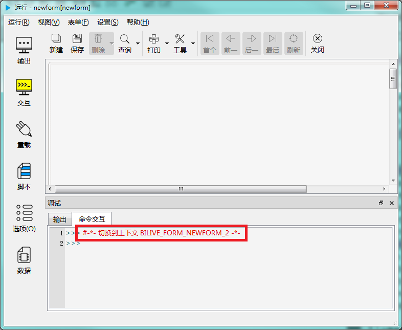

# biForm 中表单的上下文环境

这篇文章将会介绍在 biForm 中运行一个表单时的上下文环境。

## 先看看在 Python 中一个py程序的上下文环境

通常我们直接执行一个 test.py 文件，在其中用代码

``` python
print(__name__)
print(dir())
```

得到的结果会是：

```
__main__
['__annotations__', '__builtins__', '__doc__', '__file__', '__loader__', '__name__', '__package__', '__spec__']
```

如果我们在另外一个 .py 文件中导入这个 text.py 文件，再执行，它返回的结果会是：
```
test
['__builtins__', '__cached__', '__doc__', '__file__', '__loader__', '__name__', '__package__', '__spec__']
```

```__name__```在Python中是用来标识一个模块的名字的。假如当前模块是主模块，那么此模块名字就是```__main__```；假如此模块是被import的，则此模块名字为文件名字（不含后缀名.py）。

```dir()```显示的是这个模块包含的变量、对象、属性、类定义等。

## 再来看看 biForm 中一个表单的上下文环境

我们启动 biForm，它缺省情况下就是一个新的表单。点击左侧工具栏上的“运行”进入试运行状态。窗口显示以下信息：

 

注意其中显示的是“切换到上下文 BILIVE_FORM_NEWFORM_2"。这个就是这个表单所在模块的名字。这个表单中写的所有Python脚本都是在这个模块上下文环境中运行的。

在“命令交互”窗口中查看一下 ```__name__```和```dir()```输出的内容：

 

可以看到```__name__```返回的结果就是”BILIVE_FORM_NEWFORM_2“。

从```dir()```的内容中，我们可以看出，一个表单初始化时就会导入 base64、codecs、logging、sys这几个模块。并且增加了下面这几项：

<table>
	<tr>
		<th>名称</th>
		<th>类型</th>
		<th>说明</th>
	</tr>
	<tr>
		<td>log</td>
		<td>对象</td>
		<td>提供日志输出的接口，通过 log.debug 等接口输出日志内容</td>
	</tr>
	<tr>
		<td>pub</td>
		<td>对象</td>
		<td>用于biForm/biReader的公共函数和常量，比如在一个PFF表单的脚本中可以调用 pub.openPFF 打开另一个PFF表单</td>
	</tr>
	<tr>
		<td>formclass_newform</td>
		<td>类定义</td>
		<td>当前表单（this）是这个类的一个实例</td>
	</tr>
	<tr>
		<td>this</td>
		<td>对象</td>
		<td>指当前这个表单对象，formclass_newform的实例</td>
	</tr>
	<tr>
		<td>newform</td>
		<td>对象</td>
		<td>指当前这个表单对应的控件对象，等同于 this.form，名称由表单属性”表单名称“设定</td>
	</tr>
</table>

需要注意以下几点：

1. ”BILIVE_FORM_NEWFORM_2“这个模块名并不是固定的。在运行时状态下，可能会是别的名字，所以不建议在程序中以 ```__name__``` 的值来控制程序运行。biForm 中的表单的 ```__name__``` 值是永远不会是```__main__```的。biForm 中运行表单中的程序，也不是直接以 .py 文件调用或导入运行的，所以 ```__name__``` 和文件名也没有关系。这与以前运行 .py 程序时 ```__name__``` 的值的含义有很大不同，所以在 biForm 的表单后台脚本中，一般不需要通过判断 ```__name__``` 的值来决定是否需要执行某段代码；

2. ”newform “这个名字也不是固定的。表单的属性”表单名称“是可以在设计时修改的，如果在程序中引用，同时还需要修改程序才行。所以也不建议在程序中直接使用这个对象来处理程序逻辑，建议统一用 this.form ，就不会因修改表单名称影响程序使用；

3. ”formclass_newform“是一个用来定义这个表单类的类名，在 biForm 中使用”查看所有脚本“可以看到它的定义脚本。这个是为了方便对 this 这个对象进行初始化使用的，不能在程序中调用它创建新的类的实例，那样没有什么用处；

4. ```this``` 是统一的表单的代称，在每个表单上都用来代指当前这个表单实例；

5. ```this.form``` 才是指这个表单对应的 QObject 子类实例，和 this 有不同的含义和接口。this 开放的接口比如少，对表单的操作主要是通过调用 ```this.form``` 的接口来实现的；

6. 如果在表单上添加控件，比如一个名称为 button 的按钮，就可以通过 ```this.button``` 或 ```button``` 访问这个控件，通过 this.form.button 是不行的；

7. this.form 和 this.button 等都是继承自 QObject 的。这些继承自 QObject 的对象，可以通过 ```print(obj.help())``` 打印其属性、信号、槽等接口清单，当然 dir 函数也是同样可以用的。比如

``` python
>>> print(this.form.help())
--- formDelegate ---
Properties:
objectName (QString )
width (int )
height (int )
background (QColor )
foreground (QColor )
...
Slots:
QString help()
QString className()
deleteLater() -> void
self() -> QWidget
addWidget(QWidget widget, int x, int y) -> void
addWidget(QWidget widget, int x) -> void
addWidget(QWidget widget) -> void
setBaseWidget(QWidget widget) -> void
...
Signals:
destroyed(QObject*)
destroyed()
objectNameChanged(QString)
waitingMsg(QString)
waitingStep(QString,int)
statusChanged()
```

如果不是 QObject 子类的实例，只能通过 dir 函数查看，比如 this 对象。

## 总结一下

- 表单的 ```__name__``` 永远都不会是 ```__main__```

- 表单的 ```__name__```的值不是固定的，是动态生成的

- 用 ```this``` 来指代当前这个表单

- ```this.form``` 才是这个表单的 ```QObject``` 子类实例

- ```this.controlname``` 或 ```controlname``` 是指表单上的名称为 ```controlname``` 的一个 ```QObject``` 子类实例

- 通过 ```print(obj.help())``` 可以打印名为 ```obj``` 的 ```QObject``` 子类实例的接口帮助，其它不是 ```QObject``` 子类实例的对象只能通过 ```dir()``` 函数查看
