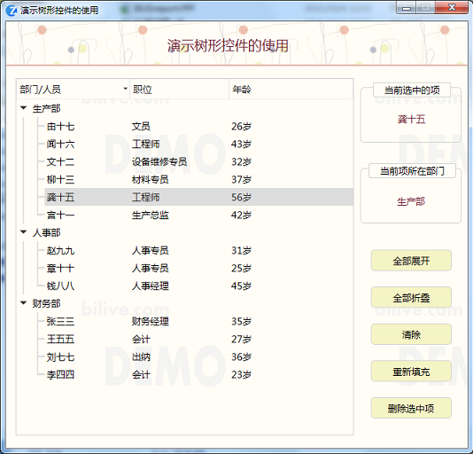
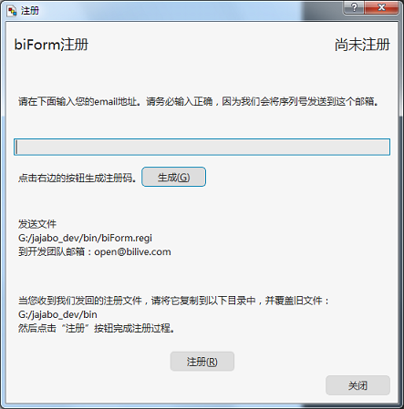

# biForm社区版激活

biForm社区版可免费长期使用，适合个人使用。开发的程序可以自用，也可以分发给朋友使用。

目前，社区版一个表单最大可用的标准控件数是50个（其它控件不受此限制），Undo/Redo支持最多20步，发布的PFF程序没有开发者数字签名，其它功能上没有什么限制。

## 未注册版本

未经注册激活的biForm社区版发布的PFF程序，在运行时，背景中会有淡淡的水印，如下图：

注册激活后发布的程序运行时不再显示水印。

## 注册激活流程：

1. 访问以下链接，并用微信扫码支付（只支持微信扫码支付）；

[支付链接](http://www.bilive.com/wx/to_pay/100000/)

2. 在biForm中调用菜单“帮助”-“注册”，按界面提示进行操作，生成 biform.regi 文件 。请保证所填写的邮箱地址是自己能正常使用的邮箱地址；

3. 将**微信支付账单截图**和上一步生成的 **biform.regi** 文件，用注册时的邮箱一起发邮件给 open@bilive.com ；

4. 在我们确认后，会将添加了激活码的 biform.regi 寄回；

5. 您在收到寄回的 biform.regi 之后按程序提示复制到指定位置。重新启动biForm，或重新点开“注册”窗口都可完成注册。

## 注意事项

注册文件是按机器绑定的，在这台机器上将会长期有效。注册激活也是长期有效的。

建议将 biform.regi 保存一份备份，重装系统或重装biForm还可以重复使用。但在新的机器上需要重新注册。

## 其它版本

biForm还将发布专业版和企业版。这两个版本将不限制标准控件数、发布的PFF中会带上开发者的数字签名、支持更多Undo/Redo步数、支持直接集成biLive运行时引擎等，并会提供更多调试和测试工具，使用专业版开发的应用可以上架我们在建的在线应用商店。社区版以后可升级到专业版，具体参考我们公司将来发布专业版和企业版时的说明。

---

访问[biForm 官方网站](https://www.bilive.com)了解更多信息