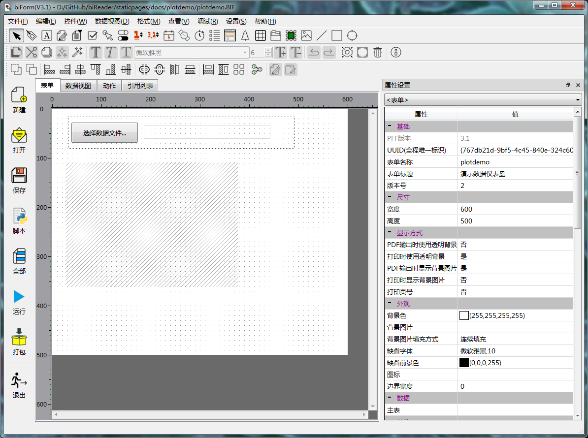
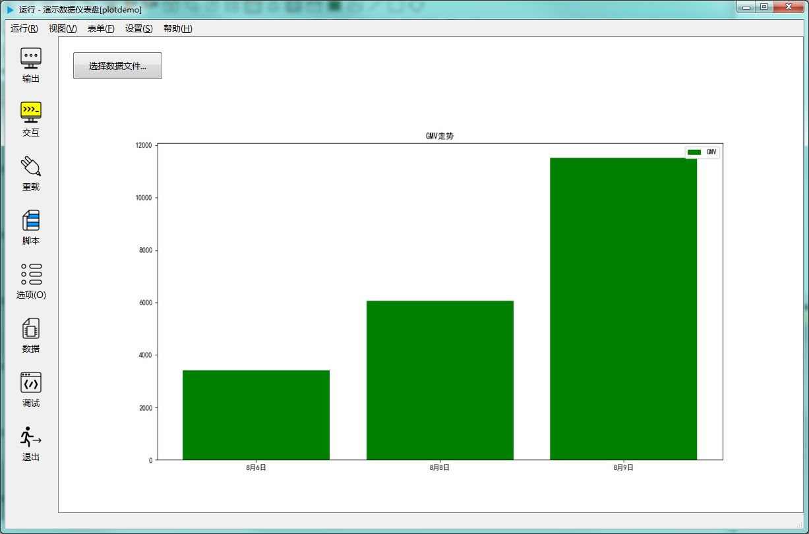
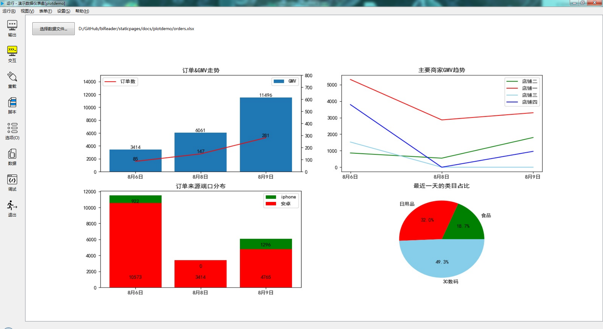

# 读取 Excel 文件中的数据制作数据仪表盘

这篇文章介绍如何用 biForm 调用 pandas 读取 Excel 文件中的数据，并调用 matplotlib.pyplot 制作数据仪表盘。

演示程序的功能，我们设想的是点击一个按钮，程序提示选择excel数据文件，然后自动在下方显示生成的数据仪表盘。

## biForm 开发步骤

### 启动 biForm

### 设计表单界面

参考下图设计出界面：



我们希望这个表单上的控件要随主窗口的大小改变自动缩放。解决方案就是在界面上只设置各个控件初始的大小和位置，再通过增加一些脚本，就能实现表单上各个控件随主窗口大小自动缩放和布局。

在“表单”-“新建空白表单后”脚本中写入：
``` python
	updateUI()
```
这段脚本调用的updateUI函数，我们需要在“表单”- “公共模块”中写入：
``` python
from PythonQt.Qt import QSizePolicy

def updateUI():
	#更新界面
	a=QSizePolicy()
	a.setHorizontalPolicy(QSizePolicy.Expanding)
	a.setVerticalPolicy(QSizePolicy.Fixed)
	b=QSizePolicy()
	b.setHorizontalPolicy(QSizePolicy.Expanding)
	b.setVerticalPolicy(QSizePolicy.Expanding)
	c=QSizePolicy()
	c.setHorizontalPolicy(QSizePolicy.Fixed)
	c.setVerticalPolicy(QSizePolicy.Fixed)
	d=QSizePolicy()
	d.setHorizontalPolicy(QSizePolicy.Fixed)
	d.setVerticalPolicy(QSizePolicy.Expanding)
	#---
	this.button.setSizePolicy(c)
	this.label.setSizePolicy(a)
	this.frameTool.setSizePolicy(a)
	this.frameTool.setHLayout(['button','label'],10,10,10,10,10)
	this.form.setVLayout(['frameTool','image1'],10,10,10,10,10)
	this.image1.setSizePolicy(b)
``` 

这段脚本用来设置各个控件的位置和缩放规则。注意其中控件名称“button”、“label”、“image1”、“frameTool”需要与表单界面设计中控件名称一致。

### 试一下做一个简单的柱形图

在按钮 button 的“点击时”脚本中写入：

``` python
	showData()
```

其中调用的showData函数用于加载数据，并生成图像，需要在“表单”- “公共模块”中进行定义：

``` python
import pandas as pd
import matplotlib.pyplot as plt
import math

def showData():
	#柱形图
	plt.rcParams['font.sans-serif'] = ['SimHei']
	plt.rcParams['axes.unicode_minus'] = False
	plt.figure(figsize=(15,8))	
	filename = pub.getOpenFileName(this.form.caption,'','*.xlsx')
	if len(filename)==0:
		return
	this.label.caption = filename
	orders=pd.read_excel(filename)
	data1 = orders.groupby('付款时间')['支付金额'].sum()  #处理数据
	x = data1.index   #x值
	y = data1.values  #y值
	plt.title('GMV走势')  #图表标题
	plt.bar(x,y,label='GMV',color='green')    #其实很简单，只要把plot换成bar
	plt.legend(loc=1)  #显示图例,loc设置图例展示位置，默认为0（最优位置）、1右上角、2左上角
	#==============显示图像
	plt.savefig(pub.getTempFilePath()+'/testplt2.jpg')
	this.image1.setImage(pub.pixmap(pub.getTempFilePath()+'/testplt2.jpg'))
```

运行效果：



?>  一般我们用 plt.show() 来显示生成的图像 ，那样会弹出一个窗口。如果我们希望图像显示在窗体上，就需要先用 plt.savefig 保存到文件后，调用 this.image1.setImage 把图像从文件中加载并显示在图像控件中。

?> 在本例中我们将图像控件的”图片填充类型“属性设置为”缩放图片“能得到较好的显示效果。

### 显示更复杂的图形

我们把 showData 改复杂一点，同时显示几种图形：

``` python
import pandas as pd
import matplotlib.pyplot as plt
import math

def showData():
	filename = pub.getOpenFileName(this.form.caption,'','*.xlsx')
	if len(filename)==0:
		return
	this.label.caption = filename
	orders=pd.read_excel(filename)
	plt.rcParams['font.sans-serif'] = ['SimHei']
	plt.rcParams['axes.unicode_minus'] = False
	plt.figure(figsize=(15,8))	

	#==============第一个：每日订单与成交额走势，柱形图与折线图组合
	plt.subplot(2,2,1)   #2×2个子图：第一个
	data1 = orders.groupby('付款时间')['支付金额','订单编号'].agg({'支付金额':'sum','订单编号':'count'})  #处理数据
	x = data1.index
	y1 = data1['支付金额']  #y主轴数据
	y2 = data1['订单编号']  #y次轴数据
	plt.title('订单&GMV走势')  #图表标题 
	plt.bar(x,y1,label='GMV')  #GMV柱形图
	plt.ylim(0,15000)   #设置y1的坐标轴范围
	for a,b in zip(x,y1):  #添加数据标签
		plt.text(a,b+0.1,'%d'%b,ha='center',va='bottom')  #在x,y1+0.1的位置上添加GMV数据 ， '%d'%y 即标签数据, ha和va控制标签位置
	plt.legend(loc=1)  #显示图例，loc=1为右上角

	plt.twinx()  #次纵坐标轴
	plt.plot(x,y2,label='订单数',color='red')  #订单折线图，红色
	plt.ylim(0,800) #设置y2的坐标轴范围
	for a,b in zip(x,y2):  #添加数据标签
		plt.text(a,b+0.2,'%d'%b,ha='center',va='bottom')  #在x,y2+0.1的位置上添加订单数据 
	plt.legend(loc=2)  #显示图例,loc=2为左上角
	
	#==============第二个：主要商家，每日GMV趋势。 多条折线图
	#数据处理
	data2 = pd.DataFrame(orders[orders['商家名称'].isin(['店铺一','店铺二','店铺三','店铺四'])].groupby(['商家名称','付款时间'])['支付金额'].sum())  
	#店铺的成交额
	data2_tmp = pd.DataFrame(index=set(data2.index.get_level_values(0)),columns=set(data2.index.get_level_values(1)))
	for ind in data2_tmp.index:
		for col in data2_tmp.columns:			
			try:
				data2_tmp.loc[ind,col] = data2.loc[ind,:].loc[col,'支付金额']
			except:
				data2_tmp.loc[ind,col] = 0

	plt.subplot(2,2,2)   #2×2个子图：第二个
	plt.title('主要商家GMV趋势')
	colors = ['green','red','skyblue','blue']  #设置曲线颜色
	x = sorted(data2_tmp.columns)  #日期是横轴
	for i in range(len(data2_tmp.index)):
		plt.plot(x,data2_tmp.loc[data2_tmp.index[i],:],label=data2_tmp.index[i],color=colors[i])
	plt.legend()  #显示图例,loc默认为0，即最优位置
	
	#==============第三个：订单来源端口，每日趋势。  堆积柱形图
	#数据处理
	data3_tmp = pd.DataFrame(orders.groupby(['平台来源','付款时间'])['支付金额'].sum())
	data3 = pd.DataFrame(index=set(data3_tmp.index.get_level_values(0)),columns=set(data3_tmp.index.get_level_values(1)))
	for ind in data3.index:
		for col in data3.columns:			
			try:
				data3.loc[ind,col] = data3_tmp.loc[ind,:].loc[col,'支付金额']
			except:
				data3.loc[ind,col] = 0

	barx = sorted(data3.columns)
	bary1 = data3.loc['安卓',:]
	bary2 = data3.loc['iphone',:]

	plt.subplot(2,2,3)   #2×2个子图：第三个
	plt.title('订单来源端口分布')   #底部是安卓，顶部是iPhone。先画iPhone=安卓+iPhone，再画安卓
	plt.bar(barx,bary1+bary2,label='iphone',color='green')
	plt.bar(barx,bary1,label='安卓',color='red') #底部是bar_y数据
	plt.legend()  
	for a,b,c in zip(barx,bary1,bary2):  #添加数据标签，注意：底部是安卓，即y1
		if math.isnan(b):
			plt.text(a,1000,'0',ha='center',va='bottom')  #在a,1000的位置上，添加数据标签
		else:
			plt.text(a,1000,'%d'%b,ha='center',va='bottom')  #在a,1000的位置上，添加数据标签
		if math.isnan(c):
			plt.text(a,b+c-1000,'0',ha='center',va='bottom')  #调整标签的位置
		else:
			plt.text(a,b+c-1000,'%d'%c,ha='center',va='bottom')  #调整标签的位置

	#==============第四个：类目占比。 饼图
	#最近一天的类目金额
	data4 = orders[orders['付款时间']==max(orders['付款时间'])].groupby('类目')['支付金额'].sum().sort_values()   
	plt.subplot(2,2,4)   #2×2个子图：第四个
	plt.title('最近一天的类目占比')
	plt.axis('equal')   #正圆，饼图会默认是椭圆
	plt.pie(data4.values,labels=data4.index,autopct='%1.1f%%',\
			colors=['green','red','skyblue','blue'])  #显示百分数,1位小数			
			
	#==============显示图像
	plt.savefig(pub.getTempFilePath()+'/testplt1.jpg')
	this.image1.setImage(pub.pixmap(pub.getTempFilePath()+'/testplt1.jpg'))
```

运行效果：



### 试运行

完成以上几步，程序就可以运行了。

点击 biForm 主窗口中的“运行”按钮，或按F5试运行。

在试运行过程中，可以通过命令交互的方式，输入Python语句进行调试。

### 打包

?> 在 biForm 中的运行只是用于开发时调试，如果程序要提供给最终用户，需要将程序打包成PFF文件，最终用户安装 biReader 就使用 PFF 文件来运行程序。

点击 biForm 主窗口中的“打包”按钮，或按F3就可以将程序打包发布。

## 下载示例

[本示例所用BIF文件](plotdemo/plotdemo.BIF)
[本示例生成的PFF文件](plotdemo/plotdemo.PFF)  
[本示例所用xlsx文件](plotdemo/orders.xlsx)    


