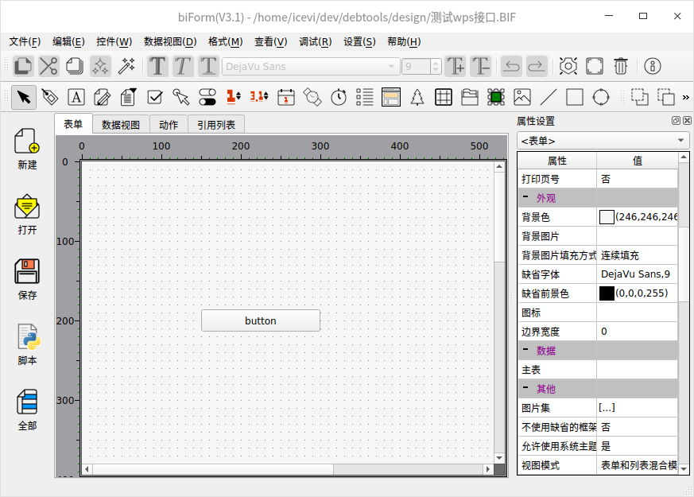
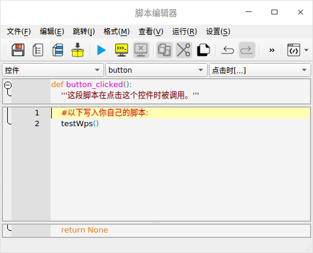
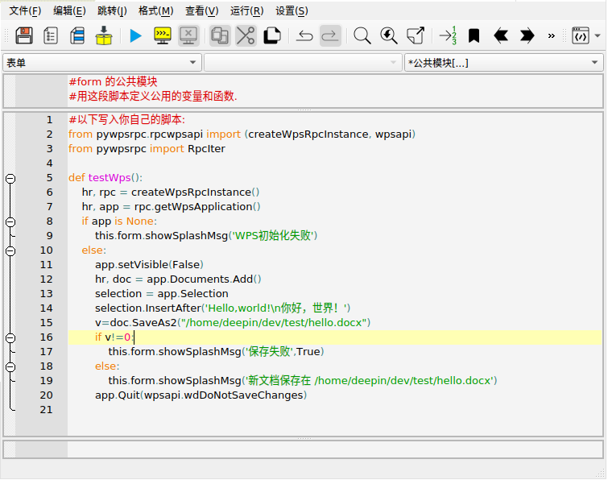
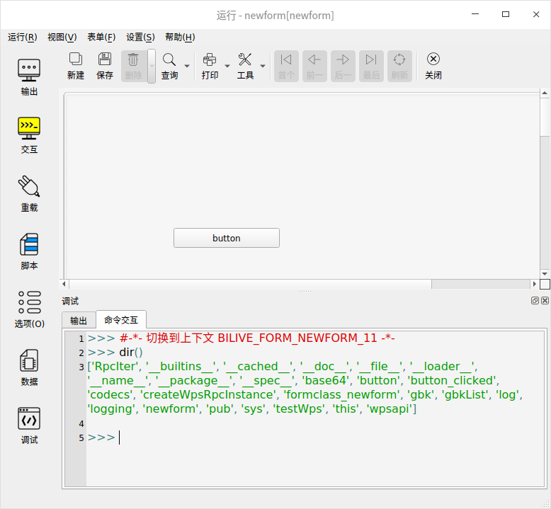
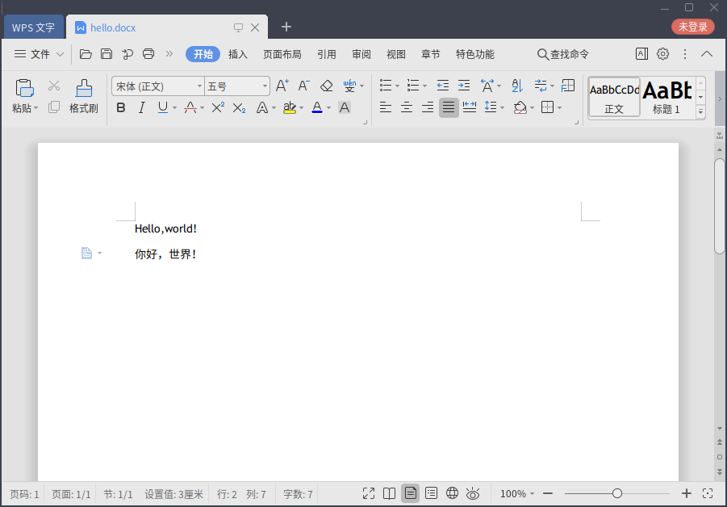

# WPS Office for Linux 二次开发演示

这篇文章介绍如何用 biForm 进行 WPS Office 的二次开发。

## 背景说明

- 开发用到了 [pywpsrpc](https://github.com/timxx/pywpsrpc) 这个项目提供的WPS Python二次开发接口
- 文章中的例子都是在 deepin V20（AMD64）中进行的测试，使用UOS的用户建议进入开发者模式后使用，否则可能不方便配置环境
- 测试时用deepin V20 应用商店安装的WPS（版本：11.1.0.9505 - Release 正式版）有问题，直接从官网下载安装WPS for Linux （版本：11.1.0.9615 - Release 正式版）是没问题的
- 目前pywpsrpc只能在**Linux**上用

## 开发前的准备
1. 安装 WPS （官网下载）
2. 运行 WPS，接受协议之类的操作都完成。确定一下“设置中心”-“切换窗口管理模式”中显示的是“多组件模式”，如果不是就切换到“多组件模式”并重启 WPS。
3. 通过应用商店安装 biForm 
4. 打开终端，输入命令 ` pip3 install pywpsrpc` 安装 pywpsrpc
5. 将 /home/deepin/.local/lib/python3.7/site-packages 下的 pywpsrpc 目录复制到 biform 相关目录下

``` 
cp -rp /home/deepin/.local/lib/python3.7/site-packages/pywpsrpc /opt/apps/com.bilive.biform/files/bin/lib/python3.6/site-packages/
```
按你机器上对应的目录修改一下命令。

## biForm 调用演示

1. 启动 biForm

2. 在空白表单上添加一个按钮



3. 在按钮的“点击时”脚本中写入：
``` python
	testWps()
```

注意testWps()前有一个**tab**符，因为这段脚本是在函数button_clicked()内部的语句，所以写入的第一行语句就要增加缩进。

?> 在 biForm 中统一用**tab**缩进，不能用空格。



4. 在脚本编辑器中选择“表单-公共模块”，写入以下Python脚本

``` python
from pywpsrpc.rpcwpsapi import (createWpsRpcInstance, wpsapi)
from pywpsrpc import RpcIter
def testWps():
	hr, rpc = createWpsRpcInstance()
	hr, app = rpc.getWpsApplication()
	if app is None:
		this.form.showSplashMsg('WPS初始化失败')
	else:
		app.setVisible(False)
		hr, doc = app.Documents.Add()
		selection = app.Selection
		selection.InsertAfter('Hello,world!\n你好，世界！')
		v=doc.SaveAs2("/home/deepin/dev/test/hello.docx")
		if v!=0:
			this.form.showSplashMsg('保存失败',True)
		else:
			this.form.showSplashMsg('新文档保存在 /home/deepin/dev/test/hello.docx')
		app.Quit(wpsapi.wdDoNotSaveChanges)
```

这段脚本因为是处于公共模块，输入的语句是从第一级开始的，所以不需要从第一行就增加缩进。

如果你要从上面复制这段代码粘贴到 biForm 中，要注意检查一下每行的缩进方式，如果是空格需要改成Tab。其中的文件目录需要改成你电脑上对应的目录。



5. 运行

完成以上几步，程序实际上就可以运行了。

点击 biForm 主窗口中的“运行”按钮，或按F5试运行。


在试运行过程中，可以通过命令交互的方式，输入Python语句进行调试。



?> 在 biForm 中的运行只是用于开发时调试，如果程序要提供给最终用户，需要将程序打包成PFF文件，并且最终用户处按前面章节所述配置好环境后才可使用。

6. 最后看看生成的文档

用WPS打开生成的 hello.docx ：



## 下载示例

[本示例所用BIF文件](test_wps.BIF)  

BIF文件用biForm打开就可查看界面和源码。

## 更多资料

- [pywpsrpc项目主页](https://github.com/timxx/pywpsrpc)  
- WPS官方的开发网站[https://open.wps.cn/docs/office](https://open.wps.cn/docs/office)
- VBA官方文档[https://docs.microsoft.com/en-us/office/vba/api/overview/](https://docs.microsoft.com/en-us/office/vba/api/overview/)
- [biForm快速入门](https://docs.bilive.com/#/guides/biform_quickstart)

